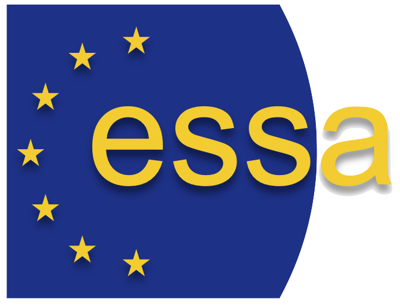

We are excited to announce the Call for Papers for the 25th International Workshop on Multi-Agent-Based Simulation (MABS 2024), a pivotal event that brings together leading researchers from Multi-Agent Systems (MAS) engineering and the social, economic, and organisational sciences.

MABS 2024 is part of the AAMAS 2024 conference taking place at [The University of Auckland](https://www.aamas2024-conference.auckland.ac.nz/) in New Zealand on 6th-10th of May, 2024.

MABS 2024 continues its tradition of fostering cross-fertilisation and innovation in MAS engineering and complex social and sociotechnical systems modeling. The workshop encourages submissions in areas such as simulation methodology and tools, simulation of social and intelligent behaviour, diverse applications, and simulation analytics. 

The MABS workshop has run alongside the main conference since AAMAS was first held in Bologna in 2002 and continues to attract a diverse and enthusiastic group of participants. This year’s focus will be on ‘Modelling and Simulation of Societies’, which aligns closely with one of the 10 themes of the main AAMAS conference.

For the MABS workshop, we encourage submission of work that is in a less finished state than we would expect to see at the main conference. We particularly encourage the submission of work that has open questions which would be worthy of discussion at the workshop.

**Quick Link to Submission Page**

First login to Easychair and then submit your abstract here:  [Submission Link through Easychair](https://easychair.org/my/conference?conf=mabs2024)

## Relevant topics
The range of technical issues that MABS has dealt with, and continues to deal with, is quite diverse and extensive. Topics relevant to this workshop include, but are not limited to: 

**Simulation methodologies and tools**
  + Standards for MABS
  + Methodologies and modeling formalism for MABS
  + Methodologies to combine MABS with other modeling approaches
  + Simulation languages, platforms and tools for MABS
  + Large-scale and distributed MABS
  + Scalability and robustness in MABS
  + Future challenges in MABS

**Simulation of Social and Intelligent behavior**
  + Formal and agent models of social behavior
  + Cognitive modeling and simulation
  + Game theory and simulation
  + Social structure, social networks and simulating organizations
  + Simulating social complexity (e.g. structures and norms, social order, emergence of cooperation and coordinated action, self-organization, the micro-macro link)

**Applications and Empirical Work**
  + MABS for socio-ecological systems
  + MABS for socio-technical systems
  + Agent-based experimental economics
  + Participatory and Human-in-the-Loop simulation
  + MABS and games
  + MABS and cloud computing
  + MABS in governance and policy-making

**Simulation Analytics**
  + Visualization and analytic tools for MABS
  + Experimental design for MABS
  + Statistical and data analysis methods for MABS
  + Data mining and machine learning methods for MABS

**Workshop Format and Location.** After a successful in-person event in London in 2023, MABS 2024 aims to continue this format in New Zealand. The workshop will feature an invited speaker/s, paper presentations, and a concluding panel discussion. The workshop duration and presentation times will be contingent on the number of submissions.

**Audience and Scope.** MABS 2024 welcomes social scientists, policy-makers, AI, MAS, and simulation researchers and developers. It's an ideal platform for those engaged in modelling multi-agent systems and applying agent-based simulation in real-world scenarios.

**Proceedings.** Post-proceedings will be reviewed further and published in the Springer LNAI series under "Multi-Agent-Based Simulation XXV, 25th International Workshop, Auckland, May 2024, Revised Papers".

**Target audience.** The workshop will provide a forum for social scientists, policy-makers, and AI, MAS and simulation researchers and developers, to assess the current state of the art in the agent-based modeling and simulation of social and socio-technical systems, to identify where and discuss how existing approaches can be successfully applied, to learn about new approaches and explore future research challenges, and to exchange ideas and knowledge in an interdisciplinary environment.

The workshop will be of interest to researchers engaged in modeling and analyzing multi-agent systems, and those interested in applying agent-based simulation techniques to real-world problems. In addition, it will attract researchers committed to cross-cutting research that is complementary to more orthodox modeling approaches.

MABS intends to be a place where researchers can exchange ideas about their work and we are looking forward to the community meeting once again in person.

## Submission guidelines
Submissions are **limited to 12 pages including references** formatted according to the [Springer LNCS style](https://www.springer.com/gp/computer-science/lncs/conference-proceedings-guidelines){:target="_blank"} and must be electronically submitted before the submission deadline through the workshop conference system, which is available here:

[Submission Link through Easychair](https://easychair.org/my/conference?conf=mabs2024)

All contributions will be peer-reviewed by at least two independent PC members. The evaluation criteria of contributions will be based on originality, quality, clarity, and its relevance to the workshop.

## Publication
Following the tradition of the previous MABS workshops, we intend to publish the accepted papers, after a further reviewing process, in the [Springer Multi-Agent-Based Simulation book series, LNAI](https://link.springer.com/conference/mabs){:target="_blank"}.

## Important Dates
Feb 5: Submission deadline

Feb 26: Review deadline

Mar 4: Acceptance/rejection notifications

Mar 11: Deadline for revised submissions

Mar 18: Submission of workshop notes

Apr 8: Preliminary program and online article availability

May 6/7: Workshop event

Aug-Dec: Preparation of Post-Proceedings for Springer LNAI

## Submission Page
First login to Easychair and then submit your abstract here: [Easychair submission link](https://easychair.org/my/conference?conf=mabs2024)

## More information
For more information or if you have queries relating to the workshop, please contact our 2024 MABS workshop Chairs and Coordinators:

**Jason Thompson** - jason.thompson@unimelb.edu.au

**Ivana Stankov** - ivana.stankov@unisa.edu.au

**Rajith Vidanaarachchi** - rajith.v@unimelb.edu.au

## Sponsors
The MABS workshop is proudly supported by the European Social Simulation Association

